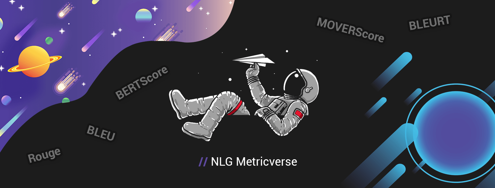

<h1 align="center">nlg-metricverse 🌌</h1>

<table align="center">
    <tr>
        <td align="left">🚀 Spaceship</td>
        <td align="left">
          <a href="https://pypi.org/project/nlg-metricverse"></a>
          <a href="https://pypi.org/project/nlg-metricverse"></a>
          <a href="https://www.python.org/"></a>
          <br>
          <a href="https://github.com/disi-unibo-nlp/nlg-metricverse/actions"></a>
          <a href="https://github.com/disi-unibo-nlp/nlg-metricverse/issues"></a>
        </td>
    </tr>
    <tr>
        <td align="left">👨‍🚀 Astronauts</td>
        <td align="left">
          <a href="https://github.com/disi-unibo-nlp/nlg-metricverse/"></a>
          <a href="https://github.com/disi-unibo-nlp/nlg-metricverse/blob/main/LICENSE"></a>
          <a href="https://GitHub.com/Nthakur20/StrapDown.js/graphs/commit-activity"></a>
        </td>
    </tr>
    <tr>
        <td align="left">🛰️ Training Program</td>
        <td align="left">
          <a href=""></a>
        </td>
    </tr>
    <tr>
        <td align="left">📕 Operating Manual</td>
        <td align="left">
            <a href="https://aclanthology.org/2022.coling-1.306/">COLING22 Long Paper</a>
        </td>
    </tr>
</table>

<br>

> One NLG evaluation library to rule them all

<p align="center">
  
</p>

### Explore the universe of Natural Language Generation (NLG) evaluation metrics.
NLG Metricverse is an end-to-end Python library for NLG evaluation, devised to provide a living unified codebase for fast application, analysis, comparison, visualization, and prototyping of automatic metrics.
* Spures the adoption of newly proposed metrics, unleashing their potential
* Reduces the implementational burden, allowing users to easily move from papers to practical applications.
* Increases comparability and replicability of NLG research.
* Provides content-rich metric cards and static/interactive visualization tools to improve metric understanding and scoring interpretation.

## Tables Of Contents
- [Motivations](#-motivations)
- [Available Metrics](#-available-metrics-and-supported-features)
- [Installation](#-installation)
    - [Explore on Hugging Face Spaces](#explore-on-hugging-face-spaces)
- [Quickstart](#-quickstart)
    - [Metric Selection](#metric-selection)
        - [Metric Documentation](#metric-documentation)
        - [Metric Filtering](#metric-filtering)
    - [Metric Usage](#metric-usage)
        - [Prediction-Reference Cardinality](#prediction-reference-cardinality)
        - [Scorer Application](#scorer-application)
        - [Metric-specific Parameters](#metric-specific-parameters)
        - [Outputs](#outputs)
- [Code Style](#code-style)
- [Custom Metrics](#-custom-metrics)
- [Contributing](#-contributing)
- [Contact](#-contact)
- [License](#license)


## 💡 Motivations
* 📖 As Natural Language Generation (NLG) models are getting better over time, accurately evaluating them is becoming an increasingly pressing priority, asking researchers to deal with semantics, different plausible targets, and multiple intrinsic quality dimensions (e.g., informativeness, fluency, factuality).
* 🤖 Task examples: machine translation, abstractive question answering, single/multi-document summarization, data-to-text, chatbots, image/video captioning, etc.
* 📌 Human evaluation is often the best indicator of the quality of a system. However, designing crowd sourcing experiments is an expensive and high-latency process, which does not easily fit in a daily model development pipeline. Therefore, NLG researchers commonly use automatic evaluation metrics, which provide an acceptable proxy for quality and are very cheap to compute.
* 📌 NLG metrics automatically compute a holistic or dimension-specific score, an acceptable proxy for effectiveness and efficiency. However, they are becoming an important bottleneck for research in the field. As we know, areas can stagnate due to poor metrics, and we believe that you shouldn't feel confined to the most traditional overlap-based techniques like ROUGE.
* 💡 If you're working on an established problem, you'll feel pressure from readers to be conservative and use the metrics that have already been tested for the same task. However, this might be a compelling pressure. Our view is that NLP engineers should enrich their evaluation toolkits with multiple metrics capturing different textual properties, being free to argue against cultural norms and motivate new ones, also exploring the latest contributions focused on semantics.
* ☠ New NLG metrics are constantly being proposed to top-tier venue conferences, but their implementation remains disrupted, with distinct environments, properties, settings, benchmarks, and features—making them difficult to compare or apply.
* ☠ The absence of a collective and continuously updated repository discourages the use of modern solutions and slows their understanding.
* 🎯 NLG Metricverse implements a large number of prominent evaluation metrics in NLG, seeking to articulate the textual properties they encode (e.g., fluency, grammatical correctness, informativeness), tasks, and limits. Understanding, using, and examining a metric has never been easier.


## 🪐 Available Metrics and Supported Features
NLG Metricverse supports 38 diverse evaluation metrics overall (last update: October 12, 2022). The code for these metrics will be progressively released in the coming weeks.

Some libraries have already tried to make an integrated environment. To our best knowledge, [NLGEval](https://github.com/Maluuba/nlg-eval), [HugginFace Datasets](https://huggingface.co/docs/datasets/index), [Evaluate](https://huggingface.co/docs/evaluate/index), [Torch-Metrics](https://torchmetrics.readthedocs.io/en/stable/), and [Jury](https://github.com/obss/jury) are the only resources available.
However, none of them possess all the properties listed below: (i) large number of heterogeneous NLG metrics, (ii) concurrent computation of more metrics at once, (iii) support for multiple references and/or predictions, (iv) meta-evaluation, and (v) visualization.

The following table summarizes the discrepancies between NLG Metricverse and related work.

| | NLG-Metricverse | NLGEval | Datasets | Evaluate | TorchMetrics | Jury |
| ------------- | ------------- | ------------- | ------------- | ------------- | ------------- | ------------- |
| #NLG-specific metrics | 38 + Datasets | 8 | 22 | 22 | 13 | 19 + Datasets |
| More metrics at once | :white_check_mark: | :x: | :x: | :white_check_mark: | :x: | :white_check_mark: |
| Multiple refs/preds | :white_check_mark: | :white_check_mark: | :x: | :x: | :x: | :white_check_mark: |
| Meta-evaluation | :white_check_mark: | :x: | :x: | :x: | :x: | :x: |
| Visualization | :white_check_mark: | :x: | :x: | :x: | :x: | :x: |

🔍 [Complete comparison and supported metrics](https://github.com/disi-unibo-nlp/nlg-metricverse/blob/main/comparison.md) 


## 🔌 Installation
Install from PyPI repository
```
pip install nlg-metricverse
```
or build from source
```
git clone https://github.com/disi-unibo-nlp/nlg-metricverse.git
cd nlg-metricverse
pip install -v .
```

#### Explore on Hugging Face Spaces
The **Spaces** edition of NLG Metricverse will be launched soon. Check it out here:
[](https://huggingface.co/spaces/disi-unibo-nlp/nlg-metricverse)

## 🚀 Quickstart

It is only <b>two lines of code</b> to evaluate generated outputs: <b>(i)</b> instantiate your scorer by selecting the desired metric(s) and <b>(ii)</b> apply it!

### Metric Selection
Specify the metrics you want to use on instantiation,
```python
# If you specify more metrics, each of them will be applyied on your data (allowing for a fast prediction/efficiency comparison)
scorer = NLGMetricverse(metrics=["bleu", "rouge"])
```
or directly import metrics from `nlgmetricverse.metrics` as classes, then instantiate and use them as desired.
```python
from nlgmetricverse.metrics import BertScore

scorer = BertScore.construct()
```
You can seemlessly access both `nlgmetricverse` and HuggingFace `datasets` metrics through `nlgmetricverse.load_metric`.
NLG Metricverse falls back to `datasets` implementation of metrics for the ones that are currently not supported; you can see the metrics available for `datasets` on [datasets/metrics](https://github.com/huggingface/datasets/tree/master/metrics). 
```python
bleu = NLGMetricverse.load_metric("bleu")
# metrics not available in `nlgmetricverse` but in `datasets`
wer = NLGMetricverse.load_metric("competition_math") # It falls back to `datasets` package with a warning
```
Note: if a selected metric requires specific packages, you'll be invited to install them (e.g., "bertscore" → `pip install bertscore`).


### Metric Usage

#### Prediction-Reference Cardinality

☠ NLG evaluation is very challenging also because the relationships between candidate and reference texts tend to be one-to-many or many-to-many. An artificial text predicted by a model might have multiple human references (i.e., there is more than one effective way to say most things), as well as a model can generate multiple distinct outputs. Such cardinality is crucial, but official implementations tend to neglect it. We do not.

<i>1:1</i>. One prediction, one reference ([p<sub>1</sub>, ..., p<sub>n</sub>] and [r<sub>1</sub>, ..., r<sub>n</sub>] syntax).
```python
predictions = ["Evaluating artificial text has never been so simple", "the cat is on the mat"]
references = ["Evaluating artificial text is not difficult", "The cat is playing on the mat."]
```
<i>1:M</i>. One prediction, many references ([p<sub>1</sub>, ..., p<sub>n</sub>] and [[r<sub>11</sub>, ..., r<sub>1m</sub>], ..., [r<sub>n1</sub>, ..., r<sub>nm</sub>]] syntax)
```python
predictions = ["Evaluating artificial text has never been so simple", "the cat is on the mat"]
references = [
    ["Evaluating artificial text is not difficult", "Evaluating artificial text is simple"],
    ["The cat is playing on the mat.", "The cat plays on the mat."]
]
```
<i>K:M</i>. Many predictions, many references ([[p<sub>11</sub>, ..., p<sub>1k</sub>], ..., [p<sub>n1</sub>, ..., p<sub>nk</sub>]] and [[r<sub>11</sub>, ..., r<sub>1m</sub>], ..., [r<sub>n1</sub>, ..., r<sub>nm</sub>]] syntax). This is helpful for language models with a decoding strategy focused on diversity (e.g., beam search, temperature sampling).
```python
predictions = [
    ["Evaluating artificial text has never been so simple", "The evaluation of automatically generated text is simple."],
    ["the cat is on the mat", "the cat likes playing on the mat"]
]
references = [
    ["Evaluating artificial text is not difficult", "Evaluating artificial text is simple"],
    ["The cat is playing on the mat.", "The cat plays on the mat."]
]
```

#### Scorer Application
```python
scores = scorer(predictions, references)
```
The `scorer` automatically selects the proper strategy for applying the selected metric(s) depending on the input format. In any case, if a prediction needs to be compared against multiple references, you can customize the reduction function to use (e.g., `reduce_fn=max` chooses the prediction-reference pair with the highest score for each of the N items in the dataset).
```python
scores = scorer.compute(predictions, references, reduce_fn="max")
```

#### Metric-specific Parameters
Additional metric-specific parameters can be specified on instantiation.
```python
metrics = [
    load_metric("bleu", resulting_name="bleu_1", compute_kwargs={"max_order": 1}),
    load_metric("bleu", resulting_name="bleu_2", compute_kwargs={"max_order": 2}),
    load_metric("bertscore", resulting_name="bertscore_1", compute_kwargs={"model_type": "microsoft/deberta-large-mnli", "idf": True}),
    load_metric("rouge")]
scorer = NLGMetricverse(metrics=metrics)
```

### Code Style
To check the code style,
```
python tests/run_code_style.py check
```
To format the codebase,
```
python tests/run_code_style.py format
```

## 🎨 Custom Metrics
You can use custom metrics by inheriting `nlgmetricverse.metrics.Metric`.
You can see current metrics implemented on NLG Metricverse from [nlgmetricverse/metrics](https://github.com/disi-unibo-nlp/nlg-metricverse/tree/main/nlgmetricverse/metrics).
NLG Metricverse itself uses `datasets.Metric` as a base class to drive its own base class as `nlgmetricverse.metrics.Metric`. The interface is similar; however, NLG Metricverse makes the metrics to take a unified input type by handling metric-specific inputs and allowing multiple cardinalities (1:1, 1:M, K:M).
For implementing custom metrics, both base classes can be used but we strongly recommend using `nlgmetricverse.metrics.Metric` for its advantages.
```python
from nlgmetricverse.metrics import MetricForLanguageGeneration

class CustomMetric(MetricForLanguageGeneration):
    def _compute_single_pred_single_ref(
        self, predictions, references, reduce_fn = None, **kwargs
    ):
        raise NotImplementedError

    def _compute_single_pred_multi_ref(
        self, predictions, references, reduce_fn = None, **kwargs
    ):
        raise NotImplementedError

    def _compute_multi_pred_multi_ref(
            self, predictions, references, reduce_fn = None, **kwargs
    ):
        raise NotImplementedError
```
For more details, have a look at base metric implementation [nlgmetricverse.metrics.Metric](./nlgmetricverse/metrics/_core/base.py)

## 🙌 Contributing
Thanks go to all these wonderful collaborations for their contribution towards the NLG Metricverse library:

<!-- ALL-CONTRIBUTORS-LIST:START - Do not remove or modify this section -->
<!-- prettier-ignore-start -->
<!-- markdownlint-disable -->
<table>
  <tr>
    <td align="center"><a href="https://giacomofrisoni.github.io/"><br /><sub><b>Giacomo Frisoni</b></sub></a></td>
    <td align="center"><a href="https://andreazammarchi3.github.io/"><br /><sub><b>Andrea Zammarchi</b></sub></a></td>
    <td align="center"><br /><sub><b>Marco Avagnano</b></sub></td>
</table>

> We are hoping that the open-source community will help us edit the code and make it better!
> Don't hesitate to open issues and contribute the fix/improvement! We can guide you if you're not sure where to start but want to help us out 🥇.
> In order to contribute a change to our code base, please submit a pull request (PR) via GitHub and someone from our team will go over it and accept it.

> If you have troubles, suggestions, or ideas, the [Discussion](https://github.com/disi-unibo-nlp/nlg-metricverse/discussions) board might have some relevant information. If not, you can post your questions there 💬🗨.

## ✉ Contact
Contact person: Giacomo Frisoni, [giacomo.frisoni@unibo.it](mailto:giacomo.frisoni@unibo.it).
This research work has been conducted within the Department of Computer Science and Engineering, University of Bologna, Italy.

## License

The code is released under the [MIT License](LICENSE). It should not be used to promote or profit from violence, hate, and division, environmental destruction, abuse of human rights, or the destruction of people's physical and mental health.
