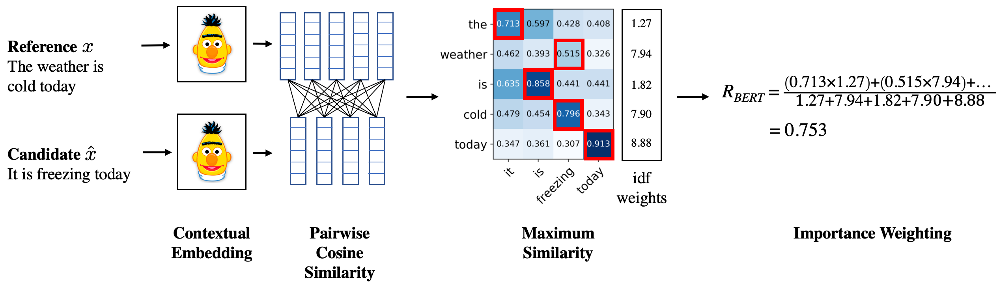

# Metric Card for BertScore

## Metric Description
BERTScore leverages the pre-trained contextual embeddings from [BERT](https://huggingface.co/bert-base-uncased) and matches words in candidate and reference sentences by cosine similarity. First, it computes a pairwise cosine similarity between each token embedding in the candidate and reference texts. Then, it produces a meaning overlapping measure by calculating a weighted average where only the cross-text token pairs with maximum similarity are taken into account with an IDF weight.

BERTScore has been shown to correlate with human judgment on sentence-level and system-level evaluation; it supports around 130 models (for which [correlation spreadsheet results](https://docs.google.com/spreadsheets/d/1RKOVpselB98Nnh_EOC4A2BYn8_201tmPODpNWu4w7xI/edit?usp=sharing) are available).

It can be seen as a special case of MOVERScore (Zhao et al., 2019), with an hard (1:1) aligment between tokens. In fact, they are both set-based metrics used to measure the semantic similarity between hypothesis and reference. BERTScore uses greedy alignment to compute the similarity between two sets of BERT-based word embeddings from hypothesis and from reference, while MOVERScore uses optimal alignments based on Word Mover's Distance (Kusner et al., 2015) to do so.

Moreover, BERTScore computes precision, recall, and F1 measure, which are useful for evaluating a range of NLG tasks.

<p align="center">
  
</p>

### Inputs
- **predictions** (`list`): Prediction/candidate sentences.
- **references** (`list`): Reference sentences.
- **lang** (`list`): Language of the sentences; required (e.g. 'en'). A string of two letters indicating the language of the sentences, in [ISO 639-1 format](https://en.wikipedia.org/wiki/List_of_ISO_639-1_codes).
- **model_type** (`str`): Bert model specification, default using the suggested model for the target language; has to specify at least one of `model_type` or `lang`.
- **num_layers** (`int`): The layer of representation to use, default using the number of layers tuned on WMT16 correlation data, which depends on the `model_type` used.
- **verbose** (`bool`): Turn on intermediate status update. The default value is `False`.
- **idf** (`bool` or `dict`): Use idf weighting; can also be a precomputed idf_dict.
- **device** (`str`): On which the contextual embedding model will be allocated on. If this argument is `None`, the model lives on `cuda:0` if cuda is available.
- **nthreads** (`int`): Number of threads for computation. The default value is `4`.
- **batch_size** (`int`): BERTScore processing batch size, at least one of `model_type` or `lang`. `lang` needs to be specified when `rescale_with_baseline` is `True`.
- **rescale_with_baseline** (`bool`): Rescale bertscore with pre-computed baseline.
- **baseline_path** (`str`): Customized baseline file.
- **use_fast_tokenizer** (`bool`): `use_fast` parameter passed to HF tokenizer. New in version 0.3.10. The default value is `False`.

### Outputs
BERTScore outputs a dictionary with the following values:
- `score`: BERTScore f1. This is always the same as 'f1' in cases single-prediction and single-reference, and single-prediction and multiple-references, otherwise it is reduced version of 'f1' by `reduce_fn`.
- `precision`: The [precision](https://huggingface.co/metrics/precision) for each sentence from the `predictions` + `references` lists. 
- `recall`: The [recall](https://huggingface.co/metrics/recall) for each sentence from the `predictions` + `references` lists.
- `f1`: The [F1 score](https://huggingface.co/metrics/f1) for each sentence from the `predictions` + `references` lists.
- `hashcode:` The hashcode of the library.

### Results from popular papers
The [original BERTScore paper](https://openreview.net/pdf?id=SkeHuCVFDr) reported average model selection accuracies (Hits@1) on WMT18 hybrid systems for different language pairs, which ranged from 0.004 for `en<->tr` to 0.824 for `en<->de`.

For more recent model performance, see the [metric leaderboard](https://paperswithcode.com/paper/bertscore-evaluating-text-generation-with).

## Bounds
BERTScore `precision`, `recall`, and `f1` belong to .

## Examples
```python
bertscore = nlgmetricverse.load_metric("bertscore")
predictions = [
  ["the cat is on the mat", "There is cat playing on the mat"],
  ["Look! a wonderful day."]
]
references = [
  ["the cat is playing on the mat.", "The cat plays on the mat."], 
  ["Today is a wonderful day", "The weather outside is wonderful."]
]
results = bertscore.compute(predictions=predictions, references=references)
print(results)
{'bertscore': {'score': 0.9473764896392822, 'precision': 0.9467198252677917, 'recall': 0.9480386078357697, 'f1': 0.9473764896392822, 'hashcode': 'roberta-large_L17_no-idf_version=0.3.10(hug_trans=4.9.1)'}}
```

## Limitations and bias
The [original BERTScore paper](https://openreview.net/pdf?id=SkeHuCVFDr) showed that BERTScore correlates well with human judgment on sentence-level and system-level evaluation, but this depends on the model and language pair selected.

Furthermore, not all languages are supported by the metric -- see the [BERTScore supported language list](https://github.com/google-research/bert/blob/master/multilingual.md#list-of-languages) for more information.

Finally, calculating the BERTScore metric involves downloading the BERT model that is used to compute the score-- the default model for `en`, `roberta-large`, takes over 1.4GB of storage space and downloading it can take a significant amount of time depending on the speed of your internet connection. If this is an issue, choose a smaller model; for instance `distilbert-base-uncased` is 268MB. A full list of compatible models can be found [here](https://docs.google.com/spreadsheets/d/1RKOVpselB98Nnh_EOC4A2BYn8_201tmPODpNWu4w7xI/edit#gid=0).  

## Citation
```bibtex
@inproceedings{bert-score,
  title={BERTScore: Evaluating Text Generation with BERT},
  author={Tianyi Zhang* and Varsha Kishore* and Felix Wu* and Kilian Q. Weinberger and Yoav Artzi},
  booktitle={International Conference on Learning Representations},
  year={2020},
  url={https://openreview.net/forum?id=SkeHuCVFDr}
}
```

## Further References
- [Official repository](https://github.com/Tiiiger/bert_score).
