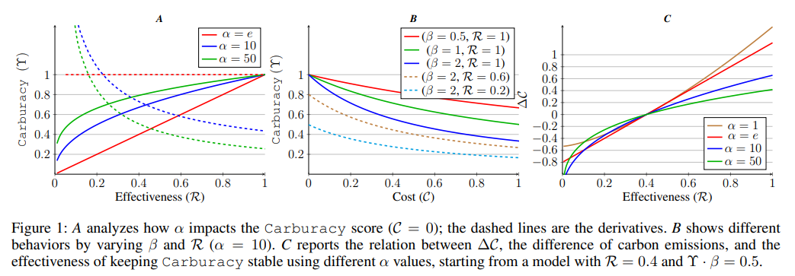

# Metric card for Carburacy

## Metric description
The Carbon-aware accuracy modeling both th AS model effectiveness and eco-sustainability:  $$\Upsilon = \frac{\left(\exp^{\log_{\alpha}\mathcal{R}}\right)}{1 + \mathcal{C}\cdot\beta}$$
Where $\mathcal{R}$ is defined in: $$\mathcal{R} = \frac{\text{avg}(r_1, r_2, r_{L\text{Sum}})}{1 + \sigma^2_r}$$
and where $C$ is the kg of CO2 emissions produced by the model to process a single instance $x$ at inference time, $\alpha$ and $\beta$ are trade-off hyperparameters.

<p align="center">
  
</p>

### Inputs
- **predictions** (istance of EvaluationInstance): An object containing the predicted text.
- **references** (istance of EvaluationInstance): An object containing the reference text.
-  **score**: The R value of the prediction.
-  **co2_val**: The CO2 value of the prediction.

### Outputs
- **carburacy**(`float` or `int`): Carburacy score. Minimum possible value is 0. Maximum possible value is 1.

### Results from popular papers

## Bounds
The `carburacy` score has a $[0,1],\uparrow$ range.

## Examples
```python
from nlgmetricverse import NLGMetricverse, load_metric
predictions = ["There is a cat on the mat.", "Look! a wonderful day."]
references = ["The cat is playing on the mat.", "Today is a wonderful day"]
scorer = NLGMetricverse(metrics=load_metric(
                                base_path + "carburacy",
                                compute_kwargs={"co2_val": "0.5"}
                              )
                        )
scores = scorer(predictions=predictions, references=references)
print(scores)
{ 
  "carburacy": { 
    'score' : 1.97
  } 
}
```

## Limitations and Bias

## Citation
```bibtex
@inproceedings{
  title = {Carburacy: summarization models tuning and comparison in eco-sustainable 
           regimes with a novel carbon-aware accuracy},
  author = {Gianluca Moro, Luca Ragazzi, Lorenzo Valgimigli},
  month = june,
  year = {2023},
  publisher = {Proceedings of the AAAI Conference on Artificial Intelligence},
  url = {https://scholar.google.com/citations?view_op=view_citation&hl=it&user=h6jngsQAAAAJ&citation_for_view=h6jngsQAAAAJ:UeHWp8X0CEIC},
  pages = {14417-14425},
}
```

## Further References

## Contributions
Thanks to @ValentinaPieri for contributing to this metric!