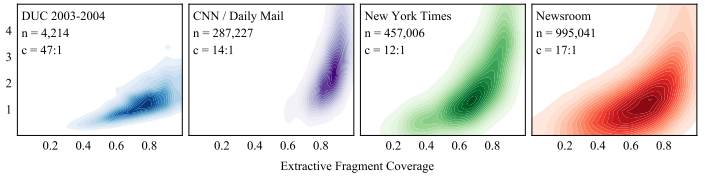

# Metric card for Coverage

## Metric description
Coverage measure quantifies the extent to which a summary is derivative of a text.
The Coverage metric measures the percentage of summary words within the source text: $$\frac{1}{|y|}\sum_{f \in \mathcal{F}(x,y)} |f|$$

Where $\mathcal{F}$ is the set of all fragments, i.e., extractive character sequences. When low, it suggest a high change for unsupported entities and facts.

<p align="center">
  
</p>

### Inputs
- **predictions** (istance of EvaluationInstance): An object containing the predicted text.
- **references** (istance of EvaluationInstance): An object containing the reference text.

### Outputs
- **coverage**(`float` or `int`): Coverage score. Minimum possible value is 0. Maximum possible value is 1. The higher the score, the higher percentage of summary words within the source text.

### Results from popular papers

## Bounds
The `coverage` score has a $[0,1],\uparrow$ range.

## Examples
```python
from nlgmetricverse import NLGMetricverse, load_metric
predictions = ["There is a cat on the mat.", "Look! a wonderful day."]
references = ["The cat is playing on the mat.", "Today is a wonderful day"]
scorer = NLGMetricverse(metrics=load_metric("coverage"))
scores = scorer(predictions=predictions, references=references)
print(scores)
{ 
  "coverage": { 
    'score' : 0.77 
  } 
}
```

## Limitations and Bias

## Citation
```bibtex
@article{grusky2018newsroom,
  title={Newsroom: A dataset of 1.3 million summaries with diverse extractive strategies},
  author={Grusky, Max and Naaman, Mor and Artzi, Yoav},
  journal={arXiv preprint arXiv:1804.11283},
  year={2018}
}
```

## Further References

## Contributions
Thanks to @ValentinaPieri for contributing to this metric!