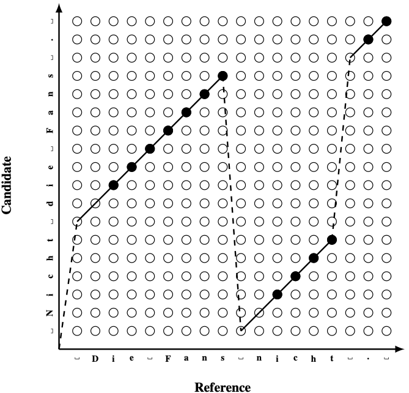

# Metric Card for Extended Edit Distance measure (EED)

## Metric Description
Extended Edit Distance (EED) is based on an extension of the Levenshtein distance. This metric follows a number of criteria:
- It is bound between zero and one.
- Its definition is kept simple, as it does not depend on external dictionaries or language analysis.
- It has competitive human correlation.
- It is fast to compute.

One aspect of each metric is its input which usu- ally comes in tokenized form. Punctuation marks are separated from words via a white space and abbreviation dots are kept next to the word e.g. *“e.g.”*. EED additionally adds a white space at both beginning and end of each sentence.

EED utilises the idea of jumps as an extension of the edit distance. It operates at character level
and is defined as follows:

$EED = min(\frac{
    (e + \alpha \cdot j) + \rho \cdot v
}{
    |r| + \rho \cdot v
}, 1)$

where $e$ is the sum of the edit operation with uniform cost of 1 for insertions and substitutions and 0.2 for deletions. $j$ denotes the number of jumps performed with the corresponding control parameter $\alpha = 2.0$. $v$ defines the number of characters that have been visited multiple times or not at all and scales over $\rho = 0.3$. EED is normalised over the length of the reference $|r|$ and the coverage penalty. To keep it within the $[0,1]$ boundary, the minimum between 1 and the metric score is taken. This makes the metric more robust in cases of extreme discrepancy between candidate and reference length.

<p align="center">
  
</p>

EED alignment lattice. Identity operations are marked with solid points, jumps with dashed lines, edit operations with full lines and blanks with $\sqcup$.

## Citation(s)
```bibtex
@inproceedings{stanchev-etal-2019-eed,
    title = "{EED}: Extended Edit Distance Measure for Machine Translation",
    author = "Stanchev, Peter  and
      Wang, Weiyue  and
      Ney, Hermann",
    booktitle = "Proceedings of the Fourth Conference on Machine Translation (Volume 2: Shared Task Papers, Day 1)",
    month = aug,
    year = "2019",
    address = "Florence, Italy",
    publisher = "Association for Computational Linguistics",
    url = "https://aclanthology.org/W19-5359",
    doi = "10.18653/v1/W19-5359",
    pages = "514--520",
    abstract = "Over the years a number of machine translation metrics have been developed in order to evaluate the accuracy and quality of machine-generated translations. Metrics such as BLEU and TER have been used for decades. However, with the rapid progress of machine translation systems, the need for better metrics is growing. This paper proposes an extension of the edit distance, which achieves better human correlation, whilst remaining fast, flexible and easy to understand.",
}
```

