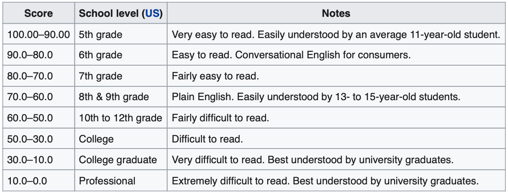

# Metric card for Flesch-Kincaid index

## Metric description
The Flesch-Kincaid readability tests are used to determine how difficult a passage in English is to understand. The Flesch Reading-Ease and Flesch-Kincaid Grade Level tests are available. Although they use the same core measures (word length and sentence length), the weighting factors are different.

The results of the two tests are roughly inversely related: a text with a relatively high Reading Ease score should have a lower Grade-Level score. The Reading Ease evaluation was developed by Rudolf Flesch; later, he and J. Peter Kincaid developed the Grade Level evaluation for the United States Navy.

In the Flesch reading-ease test, higher scores indicate material that is easier to read; lower numbers mark passages that are more difficult to read. The formula for the Flesch reading-ease score (FRES) test is:

$FRES = 206.835 - 1.015 \cdot (\frac{\text{total words}}{\text{total sentences}}) - 84.6 \cdot (\frac{\text{total syllables}}{\text{total words}})$

Scores can be interpreted as shown in the table below.

<p align="center">
  
</p>

### Inputs
-  **prepredictions** (`list`): list of predictions to score. Each predictions should be a string with tokens separated by spaces.
-  **references** (`list`): list of references to score. Each reference should be a string with tokens separated by spaces.

### Output
- **flesh_kincaid** (`float`): Flesch-Kincaid index score.

### Results from popular papers

## Bounds
The Flesch-Kincaid index can be any value in .

## Example
```python
from nlgmetricverse import NLGMetricverse, load_metric
predictions = ["There is a cat on the mat.", "Look! a wonderful day."]
references = ["The cat is playing on the mat.", "Today is a wonderful day"]
scorer = FleschKincaidPlanet()
scores = scorer(predictions=predictions, references=references)
print(scores)
{
  "flesch_kincaid": { 
    "score": 1.25 
  }
}
```

## Limitations and bias

## Citation

## Further References
- [Flesch-Kincaid Index Wikipedia Page](https://en.wikipedia.org/wiki/Flesch%E2%80%93Kincaid_readability_tests)