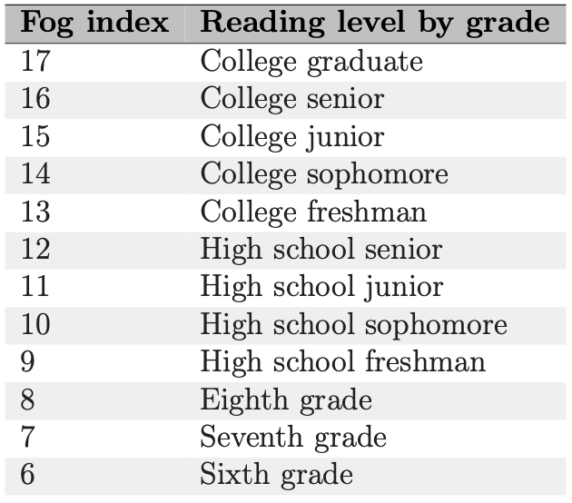

# Metric card for Gunning-Fog index

## Metric description
The Gunning fog index is a readability test for English writing in linguistics. The index calculates the number of years of formal education required to understand the text on the first reading. For example, a fog index of 12 necessitates the reading level of a senior in high school in the United States (around 18 years old). Robert Gunning, an American businessman who had previously worked in newspaper and textbook publishing, created the test in 1952.

The fog index is frequently used to ensure that text can be easily read by the intended audience. Texts aimed at a broad audience typically require a fog index of less than 12. Texts requiring near-universal comprehension typically require an index of less than 8.

The following algorithm is used to calculate the Gunning fog index:
1. Select a passage (such as one or more full paragraphs) of around 100 words. Do not omit any sentences;
2. Determine the average sentence length. (Divide the number of words by the number of sentences.);
3. Count the "complex" words consisting of three or more syllables. Do not include proper nouns, familiar jargon, or compound words. Do not include common suffixes (such as -es, -ed, or -ing) as a syllable;
4. Add the average sentence length and the percentage of complex words;
5. Multiply the result by 0.4.

The complete formula is:
$0.4 \cdot \left[ (\frac{\text{words}}{\text{sentences}}) + 100 \cdot (\frac{\text{complex words}}{\text{sentences}words}) \right] $

Scores can be interpreted as shown in the table below.

<p align="center">
  
</p>

### Inputs
- **predictions** (`list`): list of predictions to score. Each prediction should be a string with tokens separated by spaces.
- **references** (`list`): list of reference for each prediction. Each reference should be a string with tokens separated by spaces.
- **n** (`int`): number of words to consider for the Gunning-Fog index. Defaults to `1`.

### Outputs
- **score** (`float`): the Gunning-Fog index score for the text input in the list.

## Examples
```python
from nlgmetricverse import NLGMetricverse, load_metric
predictions = ["Peace in the dormitory, peace in the world.", "There is a cat on the mat."]
references = ["Peace at home, peace in the world.", "The cat is playing on the mat."]
scorer = NLGMetricverse(metrics=load_metric("gunning_fog"))
scores = scorer(predictions=predictions, references=references)
print(scores)
{
  "gunning_fog": {
    "score": 2.2 
  }
}
```
