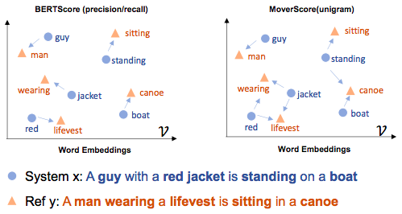

# Metric Card for MoverScore

## Metric Description
MoverScore (Zhao et.al, 2019) is an automated evaluation metric assigning a single holistic score to any system-generated text (neural or non-neural) by comparing it against human references for semantic content matching.
It is a monolingual measure evluating meaning similarities between pairs of sentences written in the same language.
It combines contextualized representations coming from language models (trained to capture distant semantic dependencies) with the Word Mover's distance (WMD).
So, MoverScore generalizes WMD by working on n-grams.

Specifically, it computes the minimum cost of transforming (transportation distance) the generated text to the reference text, taking into account Euclidean distance between vector representations of n-gram as well as their document frequencies.
According to the authors, MoverScore can be seen as a generalization of BertScore.
Both of them use contextualized representations, but they have a different focus.
BertScore aligns each hypothesis word with a single reference word (1:1), while MoverScore makes a soft alignment (1:N).

MoverScore demonstrates strong generalization capability across multiple tasks, achieving much higher correlation with human judgments than BLEU on machine translation, summarization and image captioning.

We consider MOVERScore v2, which is faster than the original implementation (by disabling powermean) but a bit worse in performance.

<p align="center">
  
</p>

### Inputs
- **predictions** (`list`): prediction/candidate sentences.
- **references** (`list`): reference sentences.
- **idf_dict_ref** (`dict`): idf dictionary extracted from the reference corpus.
- **idf_dict_hyp** (`dict`): idf dictionary extracted from the system hypothesis corpus.
- **stop_words** (`list`): a set of functional words to ignore.
- **n_gram** (`int`): unigram-based MoverScore (n-gram=1), bigram-based MoverScore (n-gram=2).
- **remove_subwords** (`bool`): if `True`, remove the specified stopwords.
- **model** (`str`): the pre-trained model to use. Default: `distilbert-base-uncased`.

### Outputs
BERTScore outputs a dictionary with the following values:
- **score** (`float`): the predicted MoverScore.

### Results from popular papers

## Bounds
Intuitively, MoverScore assigns a perfect score to the system text if it conveys the same meaning as the reference text.
Any deviation from the reference content can then lead to a reduced score, e.g., the system text contains more (or less) content than the reference, or the system produces ill-formed text that fails to deliver the intended meaning. In general, higher scores refer to better performance.

## Examples
```python
from nlgmetricverse import NLGMetricverse, load_metric
scorer = NLGMetricverse(metrics=load_metric("moverscore"))
predictions = [
    ["Evaluating artificial text has never been so simple", "The evaluation of automatically generated text is simple."],
    ["the cat is on the mat", "the cat likes playing on the mat"]
]
references = [
    ["Evaluating artificial text is not difficult", "Evaluating artificial text is simple"],
    ["The cat is playing on the mat.", "The cat plays on the mat."]
]
scores = scorer(predictions=predictions, references=references)
print(scores)
{
    "moverscore": {
        "score": 0.5148001048996513,
    }
}
```

## Limitations and bias
The paradigm of reference-based measures is useful for targeted generation tasks such as translation and summarization where matching a set of references is paramount.
It is, however, unsuitable for open-ended generation where there typically are several plausible continuations for each context and creative generations are desirable.

## Citation
```bibtex
@inproceedings{zhao2019moverscore,
  title = {MoverScore: Text Generation Evaluating with Contextualized Embeddings and Earth Mover Distance},
  month = {August},
  year = {2019},
  author = {Wei Zhao, Maxime Peyrard, Fei Liu, Yang Gao, Christian M. Meyer, Steffen Eger},
  address = {Hong Kong, China},
  publisher = {Association for Computational Linguistics},
  booktitle = {Proceedings of the 2019 Conference on Empirical Methods in Natural Language Processing},
}
```

## Further References
- [MoverScore Repository](https://github.com/AIPHES/emnlp19-moverscore)
