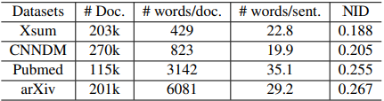

# Metric card for NID

## Metric description
The NID metric captures redundancy, as the inverse of a diversity metric with length normalization. Diversity is defined as the entropy of summary unigrams. Because longer documents are more
likely to have a higher entropy, we normalize the
diversity with the maximum possible entropy for
the document $log(|\bm{y}|)$. So, we have: $$1 - \frac{entropy(\bm{y})}{log(|\bm{y}|)}$$

<p align="center">
  
</p>

### Inputs
- **predictions** (istance of EvaluationInstance): An object containing the predicted text.
- **references** (istance of EvaluationInstance): An object containing the reference text.

### Outputs
- **nid**(`float` or `int`): NID score. The lower score means a lesser redundancy.

### Results from popular papers

## Bounds
The `nid` score has a $$[0,1],\downarrow$$ range.

## Examples
```python
from nlgmetricverse import NLGMetricverse, load_metric
predictions = ["There is a cat on the mat.", "Look! a wonderful day."]
references = ["The cat is playing on the mat.", "Today is a wonderful day"]
scorer = NLGMetricverse(metrics=load_metric("nid"))
scores = scorer(predictions=predictions, references=references)
print(scores)
{ 
  "nid": { 
    'score': 0.5101,
    }
}
```

## Limitations and Bias

## Citation
```bibtex
@inproceedings{xiao-carenini-2020-systematically,
    title = "Systematically Exploring Redundancy Reduction in Summarizing Long Documents",
    author = "Xiao, Wen  and
      Carenini, Giuseppe",
    booktitle = "Proceedings of the 1st Conference of the Asia-Pacific Chapter of the Association for Computational Linguistics and the 10th International Joint Conference on Natural Language Processing",
    month = dec,
    year = "2020",
    address = "Suzhou, China",
    publisher = "Association for Computational Linguistics",
    url = "https://aclanthology.org/2020.aacl-main.51",
    pages = "516--528",
    abstract = "Our analysis of large summarization datasets indicates that redundancy is a very serious problem when summarizing long documents. Yet, redundancy reduction has not been thoroughly investigated in neural summarization. In this work, we systematically explore and compare different ways to deal with redundancy when summarizing long documents. Specifically, we organize existing methods into categories based on when and how the redundancy is considered. Then, in the context of these categories, we propose three additional methods balancing non-redundancy and importance in a general and flexible way. In a series of experiments, we show that our proposed methods achieve the state-of-the-art with respect to ROUGE scores on two scientific paper datasets, Pubmed and arXiv, while reducing redundancy significantly.",
}
```

## Further References

## Contributions
Thanks to @ValentinaPieri for contributing to this metric!