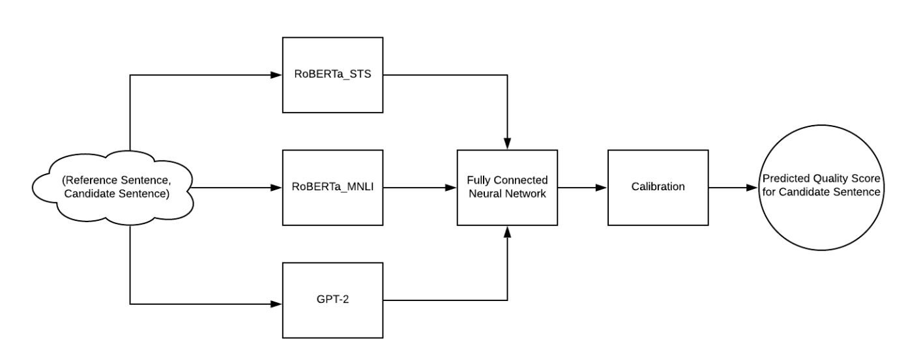

# Metric Card for Nubia

## Metric Description
NUBIA is a SoTA evaluation metric for text generation. It stands for NeUral Based Interchangeability Assessor. In addition to returning an interchangeability score, NUBIA also returns scores for semantic relation, contradiction, irrelevancy, logical agreement, and grammaticality.

<p align="center">
  
</p>

Nubia is composed of three modules.
- The first is **neural feature extraction**. The three main neural features that power the metric are semantic similarity, logical inference, and sentence legibility. These are extracted by exposing layers from powerful (pretrained) language models: RoBERTa STS for semantic similarity, RoBERTa MNLI for logical inference, and GPT-2 for sentence legibility.
- The second module is the **aggregator**. This module is trained to approximate a function mapping input neural features to a quality score that reflects how interchangeable the sentences are. The objective is to come as close as possible to human evaluation.
- The final module is **calibration**. This is necessary because the aggregator is not bound between 0 and 1, nor does a regressed score comparing a reference sentence with itself always ouput 1. So to calibrate, the output is normalized against the score of the reference sentence compared with itself, and bound between 0 and 1.

## Example
```Python
s1, s2 = "He agreed to a proposal of mine.","He gave his agreement to my proposal."
nubia.score(s1, s2, True)
```
```json
Nubia Score: 0.9504227034094436
Semantic relation: 4.672990322113037/5.0
Percent chance of contradiction: 0.26220036670565605%
Percent chance of irrelevancy or new information: 0.5306123290210962%
Percent chance of logical agreement: 99.20719265937805%
```

## Citation(s)
```bibtex
@misc{kane2020nubia,
    title={NUBIA: NeUral Based Interchangeability Assessor for Text Generation},
    author={Hassan Kane and Muhammed Yusuf Kocyigit and Ali Abdalla and Pelkins Ajanoh and Mohamed Coulibali},
    year={2020},
    eprint={2004.14667},
    archivePrefix={arXiv},
    primaryClass={cs.CL}
}
```

