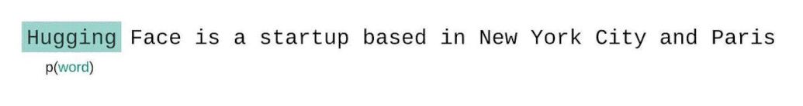

# Metric Card for Perplexity

## Metric Description
Given a model and an input text sequence, perplexity measures how likely the model is to generate the input text sequence.
So, perplexity is a common metric for directly assessing how well a selection of text matches the distribution of text that the input model was trained on.

Perplexity is defined as the exponentiated average negative log-likelihood of a sequence. If we have a tokenized sequence .
Then, the perplexity of  is,<br>
<br>
where  is the log-likelihood of the ith token conditioned on the preceding tokens  according to our model.
So, the final perplexity is obtained by averaging all the obtained log-likelihoods (geometric mean).

Intuitively, it can be thought of as an evaluation of the model's ability to predict uniformly among the set of specified tokens in a corpus.
Importantly, this means that the tokenization procedure has a direct impact on a model's perplexity which should always be taken into consideration when comparing different models.

<i>Note:</i> Language modeling—or more specifically, history-based language modeling (as opposed to full sentence models)—is the task of predicting the next word in a text given the previous words.
For instance, we consider the history "Mary likes her coffee with milk and".
Since there's no "right" answer, we'll let our learned model propose a probability distribution over all possible next words.
We say that this model is good if it assigns high probability to "sugar" and low probability to "socks".

Perplexity just measures the cross entropy between the empirical distribution (the distribution of things that actually appear in the data) and the predicted distribution (what your model likes).

Perplexity is the inverse of probability and, with some [assumptions](http://www.cs.cmu.edu/~roni/11761/PreviousYearsHandouts/gauntlet.pdf), can be seen as an approximation of the cross-entropy between the model's predictions and the true underlying sequence probabilities.
The guiding idea behind perplexity is that a good model will assign high probability to the sequences in the test data.
This is an intuitive, expedient intrinsic evaluation, and it matches well with the objective for models trained with a cross-entropy or logistic objective.

Perplexity is intended for any language generation task.

If we weren't limited by a model’s context size, we would evaluate the model’s perplexity by autoregressively factorizing a sequence and conditioning on the _entire_ preceding subsequence at each step.
However, we typically have a constraint on the number of tokens the model can process (e.g., 1024 for the [GPT-2](https://huggingface.co/docs/transformers/model_doc/gpt2) largest version).
So, with fixed-length models (like most transformers), we can’t always condition on the entire preceding subsequence when predicting each token.

The initial instinct for many in dealing with this problem is to break the whole sequence into segments equal to the model’s max input size and calculate the likelihoods of each segment independently.
This not the best approach, however, since it gives the model very little context to use for prediction at the beginning of each segment.
E.g., when the model starts the second segment, it has to try to predict the first word without any context, even though we have n words before it (belonging to the previous segment) that the model could be using.

<p align="center">
  
</p>

A better approach is to instead employ a sliding window strategy (window size = max length), where you continually move the context across the sequence (by a certain stride, i.e., not necessary 1 token a time), allowing the model to take advantage of the available context.
This is slower to compute, but will typically yield better scores and is actually much closer to the way the sequence probabilities are formally decomposed.
The smaller the stride, the more context the model will have in making each prediction, and the better the reported perplexity will typically be.
The downside of stride=1 is that it requires a separate forward pass for each token in the corpus (slower computation).
Thus, the stride models an approximation (trade-off).
Setting the stride length equal to the max input length is equivalent to the suboptimal, non-sliding-window strategy mentioned above.

<p align="center">
  
</p>

### Inputs
- **predictions** (`list`): list of predictions to score. Each prediction
        should be a string with tokens separated by spaces.
- **references** (`list`): list of reference for each prediction. Each
        reference should be a string with tokens separated by spaces.
- **model_id** (`str`): hugging face model used for calculating Perplexity. Note: perplexity can only be calculated for classical causal (or autoregressive) language models.
  - This includes models such as GPT-2, causal variations of BERT, causal versions of T5, and more (the full list can be found in the [AutoModelForCausalLM documentation](https://huggingface.co/docs/transformers/master/en/model_doc/auto#transformers.AutoModelForCausalLM).
- **input_texts** (`list of str`): input text, each separate text snippet is one list entry. Perplexity returned will be an average of the perplexity for each list entry.
- **stride** (`int`): stride size, defaults to `512`.
- **device** (`str`): device to run on, defaults to `cuda` when available.

### Outputs
Perplixity outputs a dictionary with the following values:
- **score** (`float`): the average perplexity score for the text input in the list.

## Bounds
The perplexity range is , where a lower score is better.

## Examples
```python
import json # Just for pretty printing the output metric dicts
from nlgmetricverse import NLGMetricverse, load_metric
predictions = ["Peace in the dormitory, peace in the world.", "There is a cat on the mat."]
references = ["Peace at home, peace in the world.", "The cat is playing on the mat."]

scorer = NLGMetricverse(metrics=load_metric("perplexity"))
scores = scorer(predictions=predictions, references=references)
print(json.dumps(scores, indent=4))
{
    "total_items": 2,
    "empty_items": 0,
    "total_time_elapsed": 0.3003244400024414,
    "perplexity": {
        "perplexities": [
            16.518978118896484,
            16.501928329467773
        ],
        "mean_perplexity": 16.51045322418213,
        "time_elapsed": 0.3003244400024414
    }
}
```
When we run the above with stride = 1024, i.e. no overlap, the resulting PPL is 19.64, which is about the same as the 19.93 reported in the GPT-2 paper.
By using stride = 512 and thereby employing a striding window strategy, this jumps down to 16.53.
This is not only a more favorable score, but is calculated in a way that is closer to the true autoregressive decomposition of a sequence likelihood.

## Limitations and bias
- Note that the output value is based heavily on what text the model was trained on. This means that perplexity scores are not comparable between models or evaluate.
- Perplexity is heavily dependent on the nature of the underlying vocabulary in the following sense: one can artificially lower one's perplexity by having a lot of UNK tokens in the training and test sets.
  Consider the extreme case in which everything is mapped to UNK and perplexity is thus perfect on any test set.
  The more worrisome thing is that any amount of UNK usage side-steps the pervasive challenge of dealing with infrequent words.
- As Hal Daumé discusses in [this post](https://nlpers.blogspot.com/2014/05/perplexity-versus-error-rate-for.html), the perplexity metric imposes an artificial constraint that one's model outputs are probabilistic.

## Citation
```bibtex
@article{jelinek1977perplexity,
  title={Perplexity—a measure of the difficulty of speech recognition tasks},
  author={Jelinek, Fred and Mercer, Robert L and Bahl, Lalit R and Baker, James K},
  journal={The Journal of the Acoustical Society of America},
  volume={62},
  number={S1},
  pages={S63--S63},
  year={1977},
  publisher={Acoustical Society of America}
}
```

## Further References
- [Hugging Face Perplexity Blog Post](https://huggingface.co/docs/transformers/perplexity)
- [Guide: The best way to calculate the perplexity of fixed-length models](https://discuss.huggingface.co/t/guide-the-best-way-to-calculate-the-perplexity-of-fixed-length-models/193)
