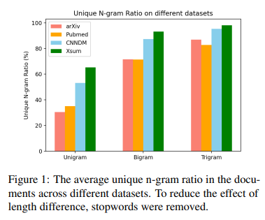

# Metric card for UNR

## Metric description
The UNR metric measures the summary of n-grams uniqueness: $$\frac{\text{count}(\text{uniq\_n\_gram}(\bm{y}))}{\text{count}(\text{n\_gram}(\bm{y}))}$$
  
Where we take $n \in [1,3]$ and divide the average by variance.

<p align="center">
  
</p>

### Inputs
- **predictions** (istance of EvaluationInstance): An object containing the predicted text.
- **references** (istance of EvaluationInstance): An object containing the reference text.

### Outputs
- **UNR**(`float` or `int`): UNR score. Minimum possible value is 0. Maximum possible value is 1, the higher the score it means the more unique the summary is.

### Results from popular papers

## Bounds
The `UNR` score has a $$[0,1],\uparrow$$ range.

## Examples
```python
from nlgmetricverse import NLGMetricverse, load_metric
predictions = ["There is a cat on the mat.", "Look! a wonderful day."]
references = ["The cat is playing on the mat.", "Today is a wonderful day"]
scorer = NLGMetricverse(metrics=load_metric("unr"))
scores = scorer(predictions=predictions, references=references)
print(scores)
{ 
  "unr": { 
    'unr_1': 0.9,
    'unr_2': 0.9444,
    'unr_3': 1.0,
    'unr_avg': 0.9481333333333334,
  } 
}
```

## Limitations and Bias

## Citation
```bibtex
@inproceedings{peyrard-etal-2017-learning,
    title = "Learning to Score System Summaries for Better Content Selection Evaluation.",
    author = "Peyrard, Maxime  and
      Botschen, Teresa  and
      Gurevych, Iryna",
    booktitle = "Proceedings of the Workshop on New Frontiers in Summarization",
    month = sep,
    year = "2017",
    address = "Copenhagen, Denmark",
    publisher = "Association for Computational Linguistics",
    url = "https://aclanthology.org/W17-4510",
    doi = "10.18653/v1/W17-4510",
    pages = "74--84",
    abstract = "The evaluation of summaries is a challenging but crucial task of the summarization field. In this work, we propose to learn an automatic scoring metric based on the human judgements available as part of classical summarization datasets like TAC-2008 and TAC-2009. Any existing automatic scoring metrics can be included as features, the model learns the combination exhibiting the best correlation with human judgments. The reliability of the new metric is tested in a further manual evaluation where we ask humans to evaluate summaries covering the whole scoring spectrum of the metric. We release the trained metric as an open-source tool.",
}
```

## Further References
- [Systematically Exploring Redundancy Reduction in Summarizing Long Documents](https://aclanthology.org/2020.aacl-main.51) (Xiao & Carenini, AACL 2020)

## Contributions
Thanks to @ValentinaPieri for contributing to this metric!