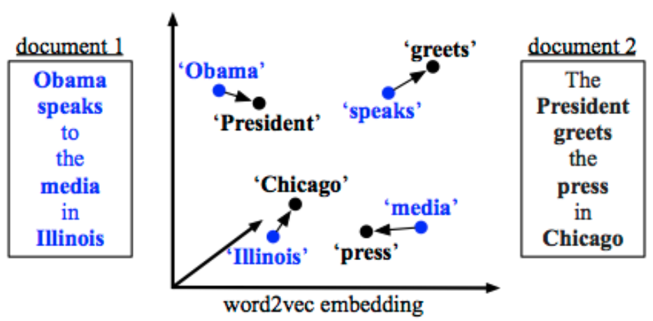
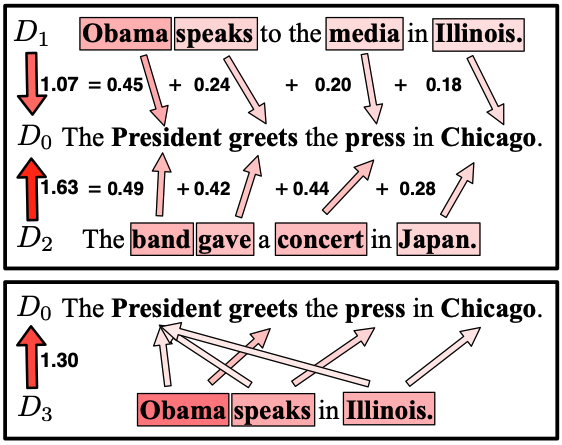

# Metric Card for Word Mover's Distance (WMD)

## Metric Description
Word Mover’s Distance (WMD), a special case of Earth Mover’s Distance, measures semantic distance between texts by aligning semantically similar words and finding the amount of flow traveling between these words. It was shown useful for text classification and textual similarity tasks. MOVERScore generalizes WMD by working on n-grams.

The WMD distance measures the dissimilarity between two text documents as the minimum amount of distance that the embedded words of one document need to “travel” to reach the embedded words of another document.

<p align="center">
  
</p>

An illustration of the word mover’s distance. All non-stop words (**bold**) of both documents are embedded into a word2vec space. The distance between the two documents is the minimum cumulative distance that all words in document 1 need to travel to exactly match document 2.

<p align="center">
  
</p>

(Top:) The components of the WMD metric between a query $D_0$ and two sentences $D_1$ , $D_2$ (with equal BOW distance). The arrows represent flow between two words and are labeled with their distance contribution. (Bottom:) The flow between two sentences $D_3$ and $D_0$ with different numbers of words. This mismatch causes the WMD to move words to multiple similar words.

### Inputs
- **predictions** (`list` of `str`): The system stream (a sequence of segments).
- **references** (`list` of `list` of `str`): A list of one or more reference streams (each a sequence of segments).

### Outputs
- **avg_distance**: average distance between predictions and references
- **distances**: distances between predictions and references

## Example
```python
from nlgmetricverse import NLGMetricverse, load_metric
predictions = ["There is a cat on the mat.", "Look! a wonderful day."]
references = ["The cat is playing on the mat.", "Today is a wonderful day"]
scorer = NLGMetricverse(metrics=load_metric("wmd"))
scores = scorer(predictions=predictions, references=references)
print(scores)
{ "wmd": {'avg_distance': 0.677252958947389, 'distances': [0.6383760813815303, 0.7161298365132478]} }

## Citation(s)
```bibtex
@inproceedings{kusner2015doc, 
   title={From Word Embeddings To Document Distances}, 
   author={Kusner, M. J. and Sun, Y. and Kolkin, N. I. and Weinberger, K. Q.}, 
   booktitle={ICML}, 
   year={2015}, 
}
```

